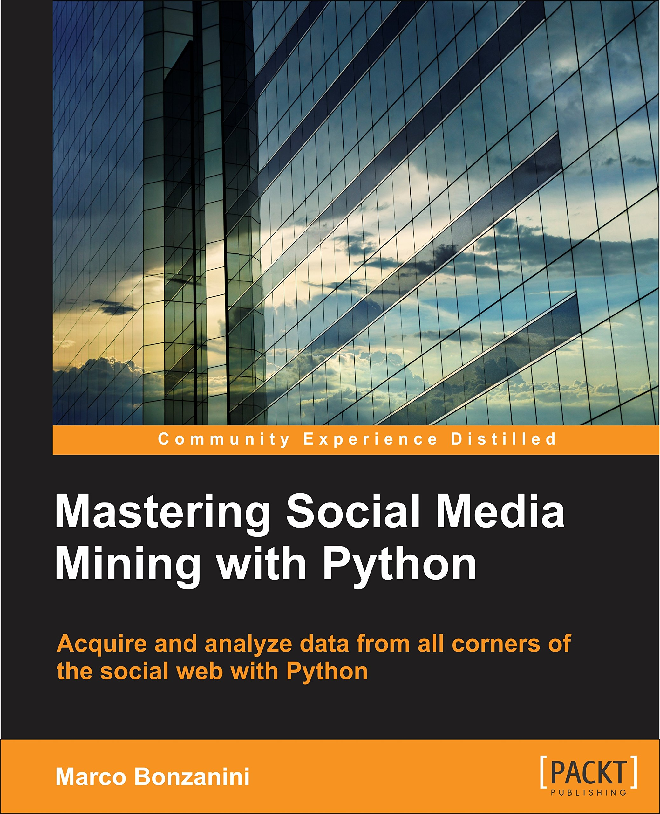

Mastering Social Media Mining with Python
=========================================

Code repository for _Mastering Social Media Mining with Python_ (July 2016)

Ebook and paperback at [Packt Publishing](https://www.packtpub.com/big-data-and-business-intelligence/mastering-social-media-mining-python "Mastering Social Media Mining with Python") (the publisher)
Ebook and paperback at [Amazon UK](https://www.amazon.co.uk/Mastering-Social-Media-Mining-Python/dp/1783552018 "Mastering Social Media Mining with Python")

The full companion code for the book will be released when the book will be published.

Setting up the environment
-----

It's strongly recommended to create a virtual environment, either with `virtualenv` or with `conda`. The following paragraph describes how to set-up the environment with `virtualenv`:

    # get the book repo
    git clone https://github.com/bonzanini/Book-SocialMediaMiningPython.git
    cd Book-SocialMediaMiningPython
    # install/upgrade virtualenv
    pip install -U virtualenv
    # create the environment
    virtualenv book_env
    # activate the environment
    source book_env/bin/activate
    # install the Python dependencies
    pip install -r requirements.txt

